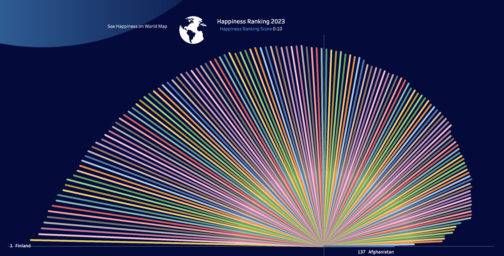
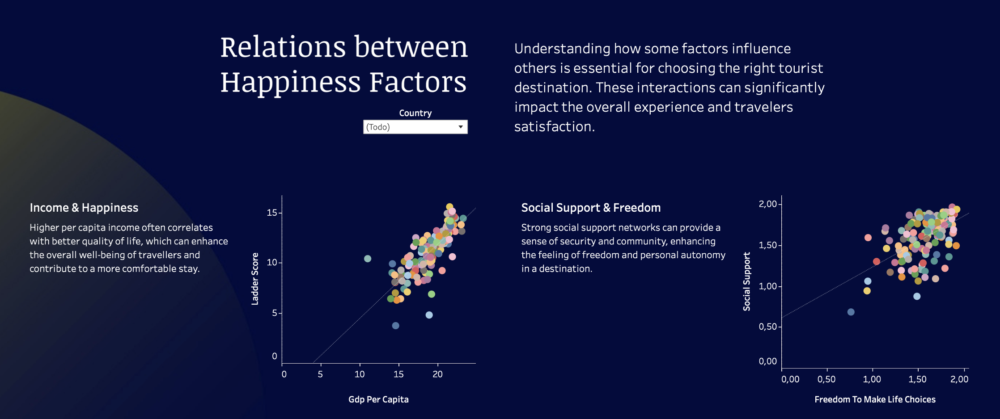

# Módulo 4
## Happy Holidays! Análisis de los mejores destinos turísticos del 2024. 
**Equipo desarrollo**: Elena Águila y Tania Graff 

La prestigiosa revista de viajes *Travelers*, nos ha encargado la elaboración de un dashboard para hacer una serie de reportajes sobre los mejores destinos turísticos de este verano. La selección y clasificación de los destinos se ha realizado tras un profundo análisis de los datos del World Happiness Report elaborado en 2023 para las Naciones Unidas. [World Happiness Report 2023](https://worldhappiness.report/ed/2023/#appendices-and-data).


## **FASE 1: Exploración, Limpieza y Transformación el Conjunto de Datos**

Se ha automatizado la primera fase del proceso de transformación y limpieza de datos para crear dos archivos .csv con los destinos mejor ranqueados en 2023, y el histórico de los mismos desde el 2008 hasta el 2022. 

### **Estructura de archivos**
**Data**
- Archivos .csv de entrada:
    - Data for Figure 2.1
    - Data for Table 2.1
- Archivos .csv de salida:
    - ranking_2023
    - ranking_historico

### **Ejecución de la Limpieza y Transformación de Datos**
El proceso de limpieza y transformación de datos está automatizado mediante un script en Python. Sigue estos pasos para ejecutar el script:

**1. Clona el Repositorio:**

```python
git clone https://github.com/TaniaGraff/Modulo4/
cd Modulo4/ETL_limpieza_y_transformacion_archivos
```

**2. Ejecuta el Script de Limpieza y Transformación:**
Navega a la carpeta `ETL_limpieza_y_transformacion_archivos/scripts` y ejecuta el script `main.py`:

```python
python scripts/main.py
```

Este script procesará los datos descargados y generará archivos limpios y transformados en la carpeta `ETL_limpieza_y_transformacion_archivos/data/output_data`.

**3. Verifica los Archivos Procesados:**
Revisa la carpeta `output_data` para asegurarte de que los archivos procesados se han generado correctamente. Estos archivos estarán listos para ser utilizados en Tableau para la creación del dashboard.


## **FASE 2: Identificación de Objetivos**

### **Objetivos de Negocio**

**1. Identificación de Destinos:** Seleccionar los  mejores destinos turísticos basados en el ranking de felicidad.

**2. Análisis de Factores:** Evaluar cómo los distintos factores considerados en el ranking de felicidad y listados a continuación, contribuyen al bienestar de los visitantes en cada destino turístico:

- `Ladder Score` (Puntaje de Escalera): Mide el nivel general de felicidad de un país.

- `Logged GDP per Capita`: PIB per cápita ajustado, indicando la riqueza económica del país.

- `Social Support` (Apoyo Social): Mide la percepción de apoyo social en el país.

- `Healthy Life Expectancy` (Expectativa de Vida Saludable): Mide la cantidad de años que se espera que una persona viva en buena salud.

- `Freedom to Make Life Choices` (Libertad para Tomar Decisiones en la Vida): Mide la percepción de libertad para tomar decisiones importantes en la vida.

- `Generosity` (Generosidad): Mide la percepción de generosidad en la sociedad.

- `Perceptions of Corruption` (Percepción de la Corrupción): Mide la percepción de corrupción en el gobierno y las instituciones.

**3. Visualización de Datos:** Proporcionar visualizaciones claras y comprensibles para facilitar la toma de decisiones informadas.

**4. Aumento de Engagement:** Atraer y retener lectores a través de contenido relevante y visualmente atractivo.


### **Preguntas Clave:**

1. Identificación de Destinos:
    - ¿Cuáles son los diez destinos turísticos más felices según el World Happiness Report?
    - ¿Cuáles son los diez destinos turísticos menos felices según el World Happiness Report?
    - ¿Cuáles son los diez destinos turísticos con mayor PIB per cápita?
    - ¿Cuáles son los diez destinos con mayor apoyo social?
    - ¿Cuáles son los diez destinos con mayor esperanza de vida?
    - ¿Cuáles son los diez destinos con mayor libertad?
    - ¿Cuáles son los diez destinos con mayor generosidad?
    - ¿Cuáles son los diez destinos con mayor corrupción?

2. Análisis de Factores:
    - ¿Qué factores (apoyo social, ingresos, salud, libertad, generosidad, ausencia de corrupción) influyen más en la felicidad de los destinos seleccionados?
    - ¿Cómo se comparan los destinos turísticos teniendo en cuenta cada uno de estos factores?

3. Impacto en la Experiencia del Turista:
    - ¿Cómo afecta la felicidad general de un destino a la experiencia del turista?
    - ¿Qué destinos ofrecen un equilibrio óptimo entre todos los factores clave de felicidad?
    - ¿Qué Factores Pueden Hacer que un Destino Sea Considerado de Alto Riesgo para los Turistas?    
    - ¿Cómo se Clasifican los Destinos Según las Diferentes Tipologías de Turismo?"

4. Recomendaciones:
Clasificar los destinos según el tipo de experiencias que pueden ofrecer a los turistas.
    - ¿Qué destinos ofrecen una experiencia de turismo excepcional y por qué?
    - ¿Qué destinos ofrecen una experiencia de turismo de alto riesgo y por qué? 
    - ¿Qué destinos ofrecen una experiencia de turismo colaborativo y solidario?
    - ¿Qué destinos ofrecen una experiencia de turismo saludable?
    - ¿Qué destinos ofrecen una experiencia de turismo de aventuras?
    - ¿Qué destinos ofrecen una experiencia de turismo feliz o de la felicidad?
    - ¿Qué destinos ofrecen una experiencia de turismo slow?


## **FASE 3: Casos de Uso**
### **Público Objetivo del Dashboard**
El dashboard está dirigido a:

**Los Editores y Escritores de la revista Travelers** para que puedan elaborar una serie de reportajes sobre los mejores destinos turísticos de este verano, basándose en datos precisos y visualmente atractivos.

El dashboard de destinos turísticos más y menos felices también sirve como un recurso útil para otros sectores relacionados con el turismo, como por ejemplo:

- **Turistas y Viajeros Potenciales**. Para proporcionarles información relevante sobre los mejores y peores destinos turísticos según los factores de felicidad.

- **Analistas de Datos**. Para realizar análisis más profundos sobre cómo los factores de felicidad afectan a los destinos turísticos.

- **Agencias de Viajes y Operadores Turísticos**. Para identificar y promocionar otro tipo de destinos, atrayendo a más clientes interesados en experiencias positivas y en las nuevas tendencias de turismo, como el turismo de la felicidad o del bienestar. O para desarrollar paquetes turísticos a medida.

- **Hoteles, Alojamiento y Restauración**. Para crear ofertas especiales y promociones en los destinos para atraer a más turistas.

- **Gobiernos y Autoridades de Turismo**. Para identificar áreas que necesitan mejoras en infraestructura y servicios públicos para aumentar la felicidad de locales y visitantes, o para implementar campañas de promoción y marketing basadas en la felicidad y el bienestar de los destinos para atraer a más visitantes.

- **Comunidades Locales y Emprendedores**. Para fomentar la participación de la comunidad local en la mejora de las experiencias para logar que el turismo tenga un impacto positivo en la localidad, además de identificar oportunidades de negocio y mejorar/ampliar sus servicios.

- **Seguros de Viaje**. Para evaluar el nivel de satisfacción y seguridad en diferentes destinos, ajustando las pólizas y primas en consecuencia, ofrecer productos de seguro específicos para los destinos que suponen un mayor riesgo para los turistas, incluyendo coberturas adicionales para imprevistos, o crear campañas de publicidad y marketing de seguros de viaje en los destinos más felices, destacando la tranquilidad y seguridad que el seguro proporciona en estos lugares.


### **Visualizaciones realizadas en Tableau**

El dashboard incluye varias visualizaciones clave para facilitar el análisis y la interpretación de los datos.

**Gráfico de barras radial** que muestra los paises ordenados en función de su puesto en el ranking de la felicidad. El gráfico redirecciona a un mapa mundi para completar la visualización.



**Gráfico temporal** que muestra la evolución de la tasa de felicidad en el país mejor y peor ranqueado a lo largo de los años, desde que se realiza el reporte mundial de la felicidad.


**Gráficos de barras** que muestran los países mejor ranqueados en función de cada uno de los seis factores clave que inciden en la felicidad de un destino.


**Gráfico de barras apiladas** que muestra los países mejor y peor ranqueados tras la combinación de los seis factores que inciden en la felicidad de un destino.


**Gráficos de dispersión** que muestran la correlación entre algunos de los factores que inciden en la felicidad de un destino.




Dashboard en Tableau del proyecto [**Happy Holidays!**](https://public.tableau.com/views/vacaciones_17213286392290/DashboardHappyHolidays)


