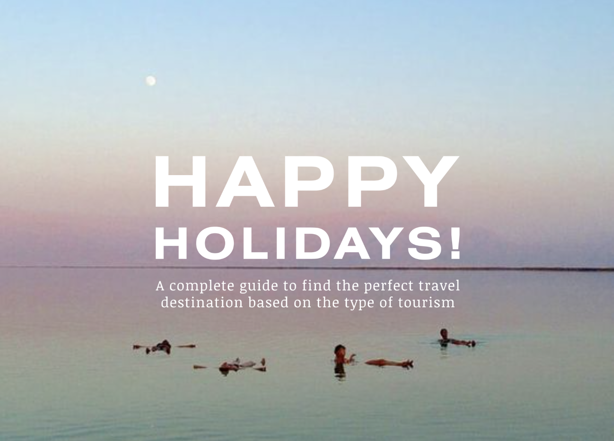

# Módulo 4
## ¿Felices Vacaciones? Análisis de los diez peores y mejores destinos turísticos del 2024.
**Equipo desarrollo**: Elena Águila y Tania Graff 

La prestigiosa revista de viajes *Travelers*, nos ha encargado la elaboración de un dashboard para hacer un reportaje con los diez mejores y peores destinos turísticos de este verano. La selección de los destinos se ha realizado tras un profundo análisis de los datos del World Happiness Report elaborado en 2023 para las Naciones Unidas.

### FASE 1: Exploración, Limpieza y Transformación el Conjunto de Datos

Se ha automatizado la primera fase del proceso de transformación y limpieza de datos para crear dos archivos .csv con los destinos mejor ranqueados en 2023, y el histórico de los mismos desde el 2008 hasta el 2022. Sigue estos pasos para ejecutar el script:

#### Descarga de Datos

Para obtener los datos necesarios para el análisis, sigue estos pasos:

1. Visita el .
2. Descarga los siguientes archivos:
- Data for Figure 2.1
- Data for Table 2.1
3.  Guarda los archivos descargados en la carpeta `ETL_limpieza_y_transformacion_archivos/data/input_data` del repositorio.

#### Ejecución de la Limpieza y Transformación de Datos
El proceso de limpieza y transformación de datos está automatizado mediante un script en Python. Sigue estos pasos para ejecutar el script:

1. Clona el Repositorio:

'''python
git clone hhttps://github.com/TaniaGraff/Modulo4/tree/main/ETL_limpieza_y_transformacion_archivos/data/input_data
cd travelers-happiness-dashboard/ETL_limpieza_y_transformacion_archivos
'''

2. Instala las Dependencias:
Asegúrate de tener Python instalado y luego instala las dependencias necesarias:

'''python
pip install -r requirements.txt
'''

3. Ejecuta el Script de Limpieza y Transformación:
Navega a la carpeta `ETL_limpieza_y_transformacion_archivos/scripts` y ejecuta el script `main.py`:

'''python
python scripts/main.py
'''

Este script procesará los datos descargados y generará archivos limpios y transformados en la carpeta `ETL_limpieza_y_transformacion_archivos/data/output_data`.

4. Verifica los Archivos Procesados:
Revisa la carpeta `output_data` para asegurarte de que los archivos procesados se han generado correctamente. Estos archivos estarán listos para ser utilizados en Tableau para la creación del dashboard.

### FASE 2: Identificación de Objetivos

#### Objetivos de Negocio

**1. Identificación de Destinos:** Seleccionar los diez mejores y diez peores destinos turísticos basados en el puntaje de felicidad.

**2. Análisis de Factores:** Evaluar cómo diferentes factores (apoyo social, ingresos, salud, libertad, generosidad, ausencia de corrupción) contribuyen a la felicidad en cada destino.

**3. Visualización de Datos:** Proporcionar visualizaciones claras y comprensibles para facilitar la toma de decisiones informadas.

**4. Aumento de Engagement:** Atraer y retener lectores a través de contenido relevante y visualmente atractivo.

#### Preguntas Clave:

1. Identificación de Destinos:
    - ¿Cuáles son los diez destinos turísticos más felices según el World Happiness Report?
    - ¿Cuáles son los diez destinos turísticos menos felices según el World Happiness Report?
2. Análisis de Factores:
    - ¿Qué factores (apoyo social, ingresos, salud, libertad, generosidad, ausencia de corrupción) influyen más en la felicidad de los destinos seleccionados?
    - ¿Cómo se comparan los destinos turísticos en cada uno de estos factores?
3. Impacto en la Experiencia del Turista:
    - ¿Cómo afecta la felicidad general de un destino a la experiencia del turista?
    - ¿Qué destinos ofrecen un equilibrio óptimo entre todos los factores clave de felicidad?
4. Recomendaciones:
    - ¿Qué destinos deberían evitarse y por qué?
    - ¿Qué destinos ofrecen una experiencia excepcional y por qué?

### FASE 3: Casos de Uso

#### Preguntas Clave y Soluciones Posibles

[En proceso]

**Caso de Uso 1:**
- Pregunta: *¿Cuáles son los diez mejores y los diez peores destinos turísticos según el puntaje de felicidad?*
- Visualización Sugerida: Gráfico de barras horizontal mostrando los puntajes de felicidad (Ladder score) de los mejores y peores destinos.

**Caso de Uso 2:**
- Pregunta:
- Visualización Sugerida:

**Caso de Uso 3:**
- Pregunta:
- Visualización Sugerida:

**Caso de Uso 4:**
- Pregunta:
- Visualización Sugerida:

**Caso de Uso 5:**
- Pregunta:
- Visualización Sugerida:

#### KPIs (Indicadores Clave de Desempeño)

Los KPIs seleccionados para este proyecto son fundamentales para evaluar y comparar los niveles de felicidad en los destinos turísticos:

- `Ladder Score` (Puntaje de Escalera): Mide el nivel general de felicidad de un país.

- `Logged GDP per Capita`: PIB per cápita ajustado, indicando la riqueza económica del país.

- `Social Support` (Apoyo Social): Mide la percepción de apoyo social en el país.

- `Healthy Life Expectancy` (Expectativa de Vida Saludable): Mide la cantidad de años que se espera que una persona viva en buena salud.

- `Freedom to Make Life Choices` (Libertad para Tomar Decisiones en la Vida): Mide la percepción de libertad para tomar decisiones importantes en la vida.

- `Generosity` (Generosidad): Mide la percepción de generosidad en la sociedad.

- `Perceptions of Corruption` (Percepción de la Corrupción): Mide la percepción de corrupción en el gobierno y las instituciones.

#### Visualizaciones en Tableau

El dashboard incluye varias visualizaciones clave para facilitar el análisis y la interpretación de los datos:

[En proceso]

#### Público Objetivo del Dashboard

El dashboard está dirigido a:

**1. Editores y Escritores de Travelers:** Para que puedan elaborar el reportaje con datos precisos y visualmente atractivos.

**2. Turistas y Viajeros Potenciales:** Para proporcionarles información relevante sobre los mejores y peores destinos turísticos según los factores de felicidad.

**3. Analistas de Datos y Profesionales del Turismo:** Para realizar análisis más profundos sobre cómo los factores de felicidad afectan a los destinos turísticos y tomar decisiones informadas.

